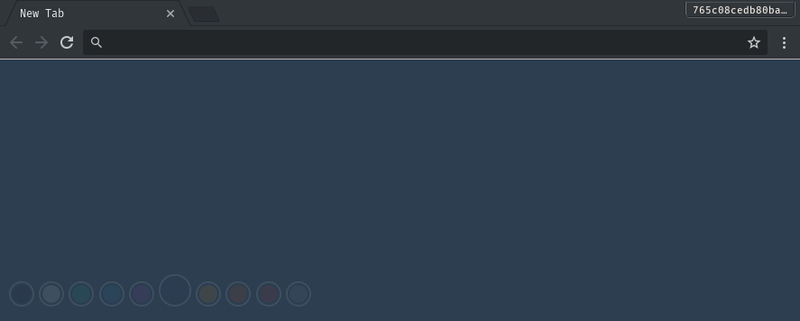
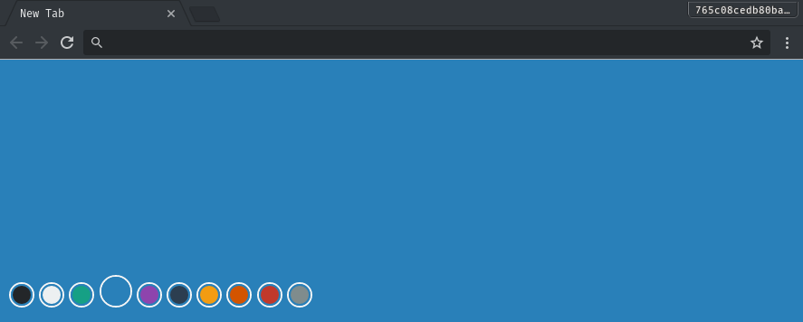

# Colored New Tab Chrome Extension

A minimalistic extensions that displays a colored new tab (with color selector).

## Screenshots

## Installation

Since it's not yet released on Google's Chrome Web Store you have to install it manually.

- Clone the repo (`git clone git@github.com:rdig/colored-new-tab.git`)
- Open your Chrome Browser *(or Chromium)*
- Go to **Settings** > **Extensions**
- Click **Load unpacked extension...**
- Point the file seletor the the folder where you clone this repo

## Permissions

The extension need the `storage` permission since it needs to store your color selection, and serve it back to you when you re-open a new tab.

## License

This is licensed under the MIT license. For more info see [LICENSE](./LICENSE)
